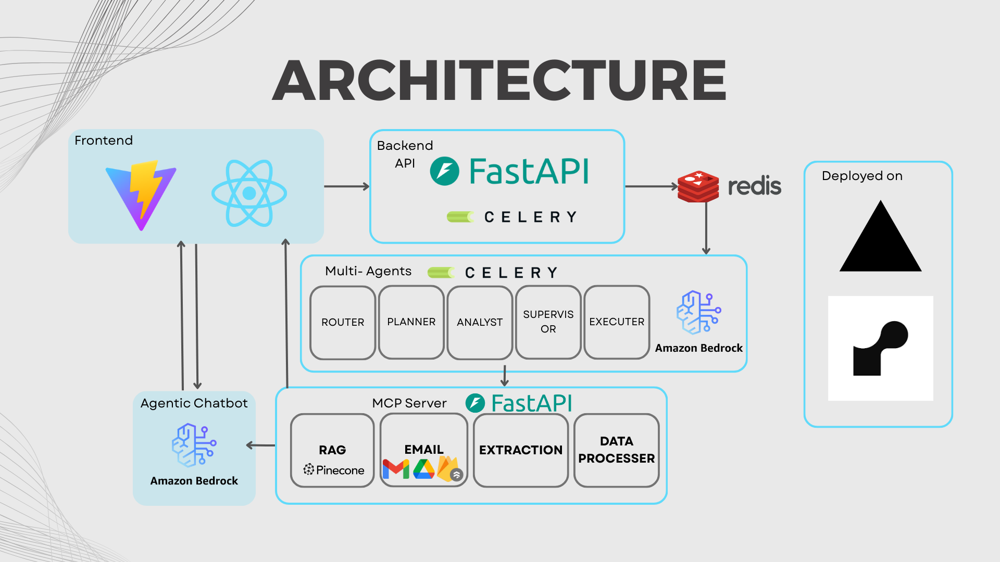
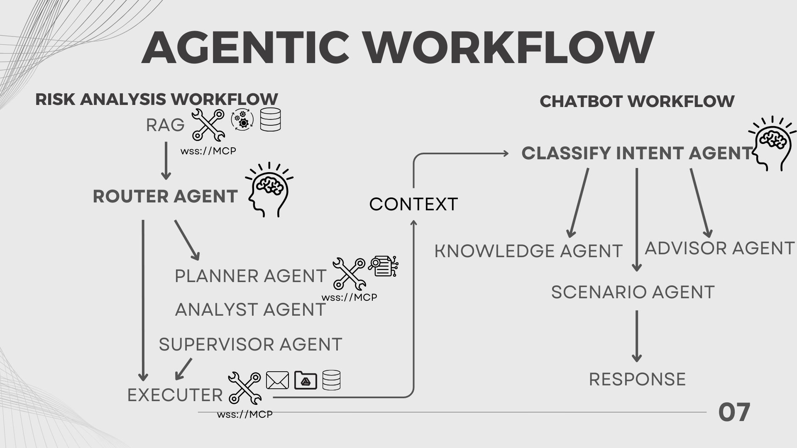

# SentinelAI 🛡️
<div align="center">
  
</div>

**AI-Powered Email Fraud Detection System**

SentinelAI is a comprehensive, multi-service fraud detection platform that uses advanced AI agents, RAG, and automation to identify and mitigate email-based security threats in real-time.

**Deployed Webpage**
Our product is live on this URL: https://sentinel-ai-seven.vercel.app/. Do note that only authorized users are granted permission to login due OAuth restrictions in development.

## 🌟 Key Features

- **🤖 Agentic Workflow**: Intelligent multi-agent system with dynamic routing based on confidence levels
- **📧 Real-time Email Monitoring**: Live Gmail integration with automatic email triage and threat detection
- **📄 Multi-format Document Processing**: Drag-and-drop support for PDF and image analysis with OCR
- **🔍 Vector Search & RAG**: Pinecone-powered similarity search for fraud pattern matching
- **� AI-Powered Chat Assistant**: Context-aware chatbot for fraud analysis and cybersecurity guidance
- **🎯 Interactive Dashboard**: Three-panel interface with email list, report viewer, and chat integration
- **⚡ Real-time Notifications**: Live email listening with instant threat alerts and processing
- **📊 Comprehensive Reports**: Detailed fraud analysis with confidence scores and explanations
- **🔄 Scalable Architecture**: Microservices with Celery workers and Redis queuing
- **� Modern UI/UX**: Responsive React interface with custom color scheme and smooth animations

## 🏗️ Architecture Overview
<div align="center">
  
</div>


## 🚀 Quick Start

### Prerequisites

- **Python 3.12+**
- **Node.js 18+** (for frontend)
- **Redis Cloud** (for Celery)
- **Google Cloud Project** (for Gmail API & Firestore)
- **Pinecone Account** (for vector database)
- **OpenAI API Key** (for AI processing)
- **OCR API** (for image and pdf parsing)

### 1. Clone Repository

```bash
git clone https://github.com/clarud/SentinelAI
cd SentinelAI
```

### 2. Backend Setup

```bash
# Install Python dependencies
cd services
pip install -r requirements.txt

# Set up environment variables
cp .env.example .env
# Edit .env with your API keys and credentials

# Start the API server
uvicorn api.app.main:app --host 0.0.0.0 --port 8000

# In another terminal, start MCP server
cd ../mcp
uvicorn server:app --reload --host 0.0.0.0 --port 7030

# In another terminal, start Celery worker
cd ../services
celery -A worker.worker.celery_app worker --loglevel=info
```

### 3. Frontend Setup

```bash
cd app
npm install
npm run dev
```

Visit `http://localhost:8080` to access the web interface.

## 📁 Project Structure

```
SentinelAI/
├── app/                          # React Frontend (Vite + TypeScript)
│   ├── src/
│   │   ├── components/           # UI Components (shadcn/ui)
│   │   ├── pages/               # Application pages
│   │   ├── hooks/               # Custom React hooks
│   │   └── lib/                 # Utilities and configurations
│   └── package.json
│
├── services/                     # Backend Services
│   ├── api/                     # FastAPI Application
│   │   ├── app/
│   │   │   ├── api/routers/     # API endpoints
│   │   │   │   ├── gmail_oauth.py   # Gmail OAuth flow
│   │   │   │   ├── gmail_watch.py   # Gmail webhook handling
│   │   │   │   ├── jobs.py          # Job management
│   │   │   │   └── health.py        # Health checks
│   │   │   ├── services/        # Business logic
│   │   │   │   ├── firestore_services.py  # Database operations
│   │   │   │   └── file_service.py        # File processing
│   │   │   └── main.py          # FastAPI app entry point
│   │   └── requirements.txt
│   │
│   └── worker/                  # Background Processing
│       ├── worker/
│       │   ├── agents/          # AI Agent System
│       │   │   ├── orchestrator.py    # Main workflow orchestrator
│       │   │   ├── prompts.py          # Agent prompts
│       │   │   └── schemas.py          # Pydantic models
│       │   ├── tasks/           # Celery tasks
│       │   │   └── email_task.py       # Email processing tasks
│       │   ├── tools/           # MCP Client Tools
│       │   │   ├── mcp_client.py       # MCP protocol client
│       │   │   ├── registry.py         # Tool registry
│       │   │   └── selector.py         # Tool selection logic
│       │   └── celery_app.py    # Celery configuration
│       └── requirements.txt
│
├── mcp/                         # Model Context Protocol Servers
│   ├── server.py               # Centralized MCP server
│   ├── mcp/
│   │   ├── data_processor/     # Document processing tools
│   │   │   ├── server.py
│   │   │   └── tools/
│   │   │       ├── process_email.py
│   │   │       └── process_pdf.py
│   │   ├── extraction_tools/   # Data extraction tools
│   │   │   ├── server.py
│   │   │   └── tools/
│   │   │       ├── extract_link.py
│   │   │       ├── extract_number.py
│   │   │       └── extract_organisation.py
│   │   ├── gmail_tools/        # Gmail & Google Drive tools
│   │   │   ├── server.py
│   │   │   └── tools/
│   │   │       ├── gmail_tools.py
│   │   │       ├── google_drive_tool.py
│   │   │       └── classify_email.py
│   │   └── rag_tools/          # Vector search & storage
│   │       ├── server.py
│   │       └── tools/
│   │           ├── call_rag.py
│   │           └── store_rag.py
│   └── requirements.txt
│
├── database/                    # Document Processing Pipeline
│   ├── document_parser.py      # Multi-format document parsing
│   ├── data_normalizer.py      # Text cleaning & normalization
│   ├── document_chunker.py     # Intelligent text chunking
│   ├── metadata_tagger.py      # Risk assessment & tagging
│   ├── vector_indexer.py       # Pinecone vector operations
│   ├── fraud_detection_pipeline.py  # Main processing pipeline
│   ├── documents/              # Input documents
│   └── requirements.txt
│
├── test/                       # Testing Suite
│   ├── worker/                 # Worker tests
│   ├── mcp/                    # MCP server tests
│   └── database/               # Database pipeline tests
│
├── render.yaml                 # Deployment configuration
└── README.md                   # This file
```

## 🧠 Agentic Workflow System

SentinelAI implements a sophisticated **multi-agent workflow** that dynamically adapts based on confidence levels:

<div align="center">
  
</div>

### Agent Types

1. **🔄 ROUTER Agent** - Intelligent workflow orchestrator
   - Analyzes initial confidence and decides optimal path
   - Routes to fast-track or full analysis based on evidence

2. **📋 PLANNER Agent** - Tool selection strategist
   - Determines which extraction tools to use
   - Optimizes evidence gathering strategy

3. **📊 ANALYST Agent** - Evidence interpreter
   - Processes all tool outputs and document content
   - Calculates risk metrics and confidence scores

4. **⚖️ SUPERVISOR Agent** - Final decision maker
   - Makes classification decisions based on analysis
   - Provides explainable reasoning for decisions

5. **⚡ EXECUTER Agent** - Action performer
   - Executes appropriate actions based on classification
   - Handles Gmail labeling, reporting, and data storage

### Workflow Routes

#### 🚀 Fast Scam (95%+ confidence, 80%+ scam probability)
```
Document → Processing → RAG → ROUTER → EXECUTER
⏱️ ~8 seconds
```

#### ✅ Fast Legitimate (95%+ confidence, <20% scam probability)
```
Document → Processing → RAG → ROUTER → EXECUTER
⏱️ ~6 seconds
```

#### 🔍 Full Analysis (50-95% confidence)
```
Document → Processing → RAG → ROUTER → PLANNER → ANALYST → SUPERVISOR → EXECUTER
⏱️ ~25 seconds
```

#### 🕵️ Deep Analysis (<50% confidence)
```
Document → Processing → RAG → ROUTER → PLANNER → ANALYST → SUPERVISOR → EXECUTER
⏱️ ~35 seconds (enhanced caution mode)
```

## 🛠️ Core Technologies

### Backend
- **FastAPI** - High-performance async API framework
- **Celery** - Distributed task queue for background processing
- **Redis** - Message broker and caching
- **WebSockets** - Real-time MCP protocol communication
- **Pydantic** - Data validation and settings management

### AI & ML
- **Bedrock** - Large language models for analysis
- **Pinecone** - Vector database for similarity search
- **ReportLab** - PDF generation for reports
- **OCR API** - Optical character recognition

### Integrations
- **Gmail API** - Email access and manipulation
- **Google Drive API** - Document storage and sharing
- **Google Cloud Firestore** - NoSQL database
- **OAuth2** - Secure authentication

### Frontend
- **React** - Modern UI framework
- **TypeScript** - Type-safe JavaScript
- **Vite** - Fast build tool
- **shadcn/ui** - Beautiful UI components
- **Tailwind CSS** - Utility-first styling
- **Tanstack Query** - Server state management

## 🎨 User Interface Features

### 🔐 Authentication Flow
- **OAuth Integration**: Seamless Google account login with branded interface
- **Logo Branding**: SentinelAI logo and "Always Watching, Always Protecting" tagline
- **Secure Redirect**: Automatic redirection to dashboard after authentication

### 📱 Three-Panel Dashboard
```
┌─────────────────┬─────────────────┬─────────────────┐
│   Email List    │  Report Viewer  │   AI Assistant  │
│   (Left Panel)  │ (Center Panel)  │  (Right Panel)  │
├─────────────────┼─────────────────┼─────────────────┤
│ • Email Listen  │ • Live/Upload   │ • Context Chat  │
│ • Email IDs     │ • Fraud Report  │ • Conversation  │
│ • File Upload   │ • Risk Scores   │ • Help & Guide  │
└─────────────────┴─────────────────┴─────────────────┘
```

### 📧 Left Panel - Email Management
- **🔄 Email Listening Toggle**: Real-time email monitoring activation
- **📋 Dynamic Email List**: Auto-updating list of incoming emails (every 10s)
- **🎯 Clickable Email Buttons**: Instant report generation on email selection
- **📎 Drag & Drop Upload**: Support for PDF and image file analysis
- **⬆️ Upload Button**: Manual file selection with progress indicators

### 📊 Center Panel - Report Display
- **🔀 Live/Upload Toggle**: Switch between real-time emails and uploaded documents
- **📧 Email Details**: Complete email metadata display (sender, subject, date, body)
- **🚨 Fraud Analysis**: 
  - **Scam Label**: Clear classification (Scam/Not Scam/Suspicious)
  - **Confidence Level**: Numerical confidence score (0.0-1.0)
  - **Scam Probability**: Percentage risk assessment (0-100%)
  - **Detailed Explanation**: AI-generated reasoning and analysis

### 💬 Right Panel - AI Chat Assistant
- **🤖 Context-Aware Responses**: Uses current report as conversation context
- **📝 Message History**: Persistent conversation tracking
- **🎯 Cybersecurity Expertise**: Specialized fraud detection and security guidance
- **⚡ Real-time Interaction**: Instant responses with typing indicators

### 🎨 Design System
- **Custom Color Palette**:
  - Primary: `#d4eaf7` (Light Blue), `#b6ccd8` (Medium Blue), `#3b3c3d` (Dark Gray)
  - Accent: `#71c4ef` (Bright Blue), `#00668c` (Deep Blue)
  - Text: `#1d1c1c` (Primary), `#313d44` (Secondary)
  - Background: `#fffefb` (Primary), `#f5f4f1` (Secondary), `#cccbc8` (Tertiary)
- **Smooth Animations**: Loading states, transitions, and micro-interactions
- **Light and Dark Mode**: Improves visibility in different environments.

### ⚡ Real-time Updates
- **Live Email Feed**: Automatic polling for new emails
- **Toast Notifications**: Success, error, and warning alerts
- **Loading States**: Spinners and skeleton screens
- **Progress Tracking**: File upload and analysis progress bars

## 🔐 Security Features
- **🛡️ OAuth2 Authentication** - Secure Google account integration
- **🚨 Real-time Monitoring** - Gmail webhook notifications
- **📊 Audit Trails** - Comprehensive logging and assessment tracking
- **🎯 Risk Scoring** - Multi-factor fraud probability calculation
- **⚡ Automated Actions** - Instant scam labeling and quarantine

## 📊 Fraud Detection Capabilities

### Document Types Supported
- **📧 Email Messages** - Headers, body, etc
- **📄 PDF Documents and Images** - OCR and text extraction

### Detection Features
- **🔗 URL Analysis** - Suspicious link detection
- **📱 Phone Number Extraction** - Contact information analysis
- **🏢 Organization Recognition** - Entity verification
- **📈 Pattern Matching** - Vector similarity search
- **🧮 Probability Scoring** - AI-driven risk assessment

### Email Monitoring
- **Real-time Email Polling**: Frontend polls for new email IDs every minute
- **Email Report Generation**: Dynamic report creation based on selected email ID
- **Live Dashboard Updates**: Automatic UI updates for incoming threats

## 📈 Performance Metrics

- **⚡ Fast Response**: 95%+ confidence cases processed in <10 seconds
- **🎯 High Accuracy**: Multi-agent validation for complex cases
- **📊 Scalable**: Horizontal scaling with Celery workers
- **🔄 Real-time**: WebSocket MCP protocol for instant tool communication
- **💾 Efficient**: Vector search for O(log n) similarity matching

## 🚀 Deployment
- **Front End**
- **API**
- **Celery Background Task**
- **MCP Server**
**Deployed on Render**

## 📊 Future Improvements

**These are some aspects we didn't manage to implement due to time constraints**

### Security
- **Better OAuth and Token handling**
- **Protection of endpoints**

### Features
- **Scaling to other platforms such as messages, phone calling**
- **Inclusion of more advanced tools to extend functionality**

## 🔗 Links

- **Live Demo**: [SentinelAI Dashboard](https://your-frontend-url.com)
- **API Documentation**: [Swagger UI](https://your-api-url.com/docs)
- **MCP Server**: [WebSocket Endpoint](wss://your-mcp-url.com/ws)

---

**Built with ❤️ by the SentinelAI Team**
*Protecting inboxes, one email at a time* 🛡️✨
